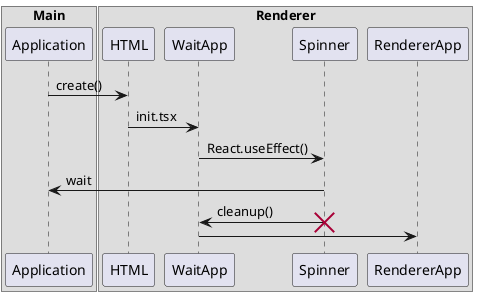

# Electron(and Castchain) Initialze

## おおまかな初期化

```plantuml
@startuml

box "Main"
participant Application as MainApp

MainApp ->  HTML : create()
'create -> HTML : mainWindow.loadURL()

end box

box "Renderer"
participant HTML

HTML -> WaitApp : init.tsx
WaitApp -> Spinner : React.useEffect()

Spinner -> MainApp : wait
Spinner -> WaitApp : cleanup()
destroy Spinner

WaitApp -> RendererApp


end box

' box "Node"
' participant index.ts
' end box

@enduml
```

## 個別コンポーネントの初期化
