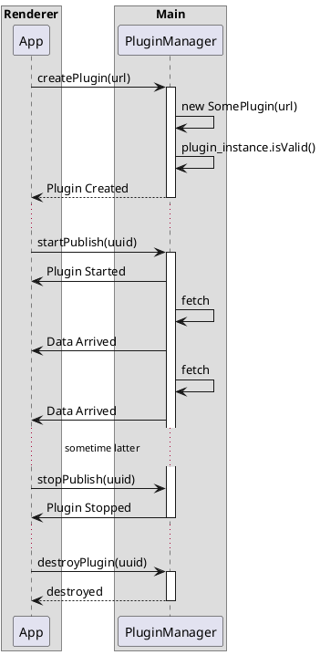

```plantuml
@startuml

box "Renderer"
  participant App as App
end box

box "Main"
  participant PluginManager as PManager
end box

''
App -> PManager : createPlugin(url)
'ref over PManager, App
'{
'  type : 'CREATE_PLUGIN'
'  payload: {
'    url: https://shitaraba.net/hogehoge
'  }
'}
'end ref

activate PManager
PManager -> PManager : new SomePlugin(url)
PManager -> PManager : plugin_instance.isValid()
return Plugin Created
'ref over PManager, App
'{
'  type : 'CREATED_PLUGIN'
'  payload: {
'    plugin_type: 'Shitaraba'
'    uuid: 'plugin-instance-id-#1'
'  }
'}
'end ref
deactivate PManager

...

App -> PManager : startPublish(uuid)
'ref over PManager, App
'{
'  type : 'START_PUBLISH'
'  payload: 'plugin-instance-id-#1'
'}
'end ref
activate PManager
PManager -> App : Plugin Started
'ref over PManager, App
'{
'  type : 'STARTED_PUBLISH'
'  payload: {
'    'plugin-instance-id-#1'
'  }
'}
'end ref

PManager -> PManager : fetch
PManager -> App : Data Arrived
'ref over PManager, App
'{
'  type : 'DATA_ARRIVED'
'  payload: {
'    'plugin-instance-id-#1'
'    error: false
'  }
'}
'end ref

PManager -> PManager : fetch
PManager -> App : Data Arrived

... sometime latter...

App -> PManager : stopPublish(uuid)
'ref over PManager, App
'{
'  type : 'STOP_PUBLISH'
'  payload: 'plugin-instance-id-#1'
'}
'end ref
PManager -> App : Plugin Stopped
deactivate PManager
'ref over PManager, App
'{
'  type : 'STOPPED_PUBLISH'
'  payload: {
'    uuid: 'plugin-instance-id-#1'
'  }
'}
'end ref

...

App -> PManager : destroyPlugin(uuid)
activate PManager
return destroyed
deactivate PManager

@enduml

```
