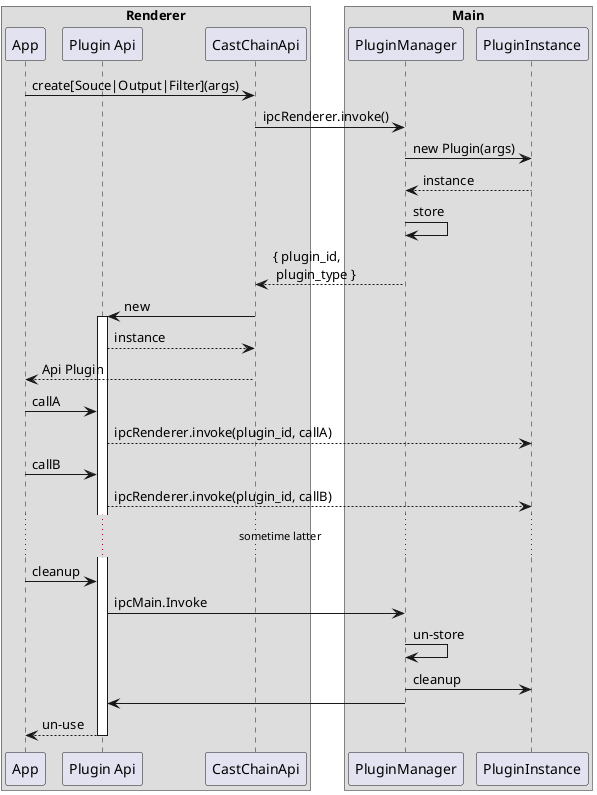
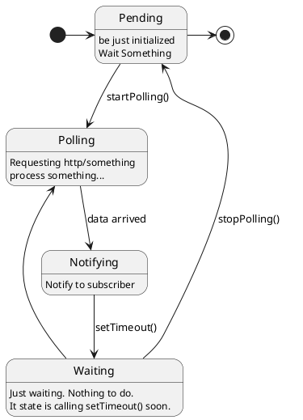
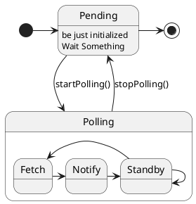
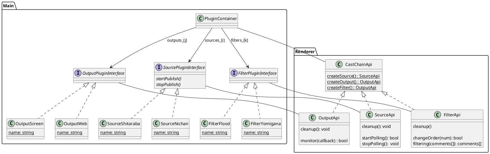

```plantuml
@startuml

box "Renderer"
  participant App as App
  participant "Plugin Api" as PApi
  participant "CastChainApi" as Api
end box

box "Main"
  participant PluginManager as PManager
  participant PluginInstance as PInstance
end box

App -> Api : create[Souce|Output|Filter](args)
Api -> PManager : ipcRenderer.invoke()
PManager -> PInstance : new Plugin(args)
return instance
PManager -> PManager :  store
PManager --> Api : { plugin_id,\n plugin_type }
Api -> PApi : new
activate PApi

PApi --> Api : instance
Api --> App :  Api Plugin

App -> PApi : callA
PApi --> PInstance : ipcRenderer.invoke(plugin_id, callA)

App -> PApi :  callB
PApi --> PInstance : ipcRenderer.invoke(plugin_id, callB)

... sometime latter...

App -> PApi : cleanup
PApi -> PManager : ipcMain.Invoke
PManager -> PManager :  un-store
PManager -> PInstance :  cleanup
PManager -> PApi
PApi --> App : un-use

deactivate PApi


@enduml
```

ところで各プラグインは Store されるわけだが、Plugin は各々・・・次のような処理関係を持つ

# Source Plugin

```plantuml
@startuml

state Pending
Pending: be just initialized
Pending: Wait Something

state Polling
Polling: Requesting http/something
Polling: process something...

state Notifying
Notifying: Notify to subscriber

state Waiting
Waiting: Just waiting. Nothing to do.
Waiting: It state is calling setTimeout() soon.

[*] -right-> Pending

Pending -down-> Polling : startPolling()

Polling -down-> Notifying : data arrived
Notifying -down-> Waiting : setTimeout()
Waiting -> Polling

Waiting -> Pending : stopPolling()

Pending -right-> [*]

@enduml
```

もう少し一般化する

```plantuml
@startuml

state Pending
Pending: be just initialized
Pending: Wait Something

[*] -right-> Pending

Pending --> Polling : startPolling()
Polling --> Pending : stopPolling()

state Polling {
  Fetch -> Notify
  Notify -> Standby
  Standby -> Standby
  Standby -> Fetch
}


Pending -right-> [*]

@enduml
```

クラスの関係図

```plantuml
@startuml

namespace Main {
class PluginContainer

interface SourcePluginInterface {
  {abstract} startPublish()
  {abstract} stopPublish()
}

class SourceShitaraba {
  {static} name: string
}
class SourceNichan {
  {static} name: string
}

interface FilterPluginInterface {
}

class FilterFlood {
  {static} name: string
}

class FilterYomigana {
  {static} name: string
}

interface OutputPluginInterface {
}

class OutputScreen{
  {static} name: string
}
class OutputWeb{
  {static} name: string
}

PluginContainer --> SourcePluginInterface : sources_[i]
PluginContainer --> OutputPluginInterface : outputs_[j]
PluginContainer --> FilterPluginInterface : filters_[k]

SourcePluginInterface <|.. SourceShitaraba
SourcePluginInterface <|.. SourceNichan
'SourcePluginInterface <|.. SourceNextbbs

FilterPluginInterface <|.. FilterFlood
FilterPluginInterface <|.. FilterYomigana

OutputPluginInterface <|.. OutputScreen
OutputPluginInterface <|.. OutputWeb

}

namespace Renderer {

class CastChainApi{
  {static} createSource() : SourceApi
  {static} createOutput() : OutputApi
  {static} createFilter() : OutputApi
}

class SourceApi{
  cleanup(): void

  startPolling(): bool
  stopPolling():  void
}

class OutputApi{
  cleanup(): void

  monitor(callback) : bool
}

class FilterApi{
  cleanup()

  changeOrder(num): bool
  filtering(comments[]): comments[]
}

CastChainApi <|.. SourceApi
CastChainApi <|.. OutputApi
CastChainApi <|.. FilterApi

}

Main.PluginContainer -- Renderer.CastChainApi
Main.SourcePluginInterface -- Renderer.SourceApi
Main.OutputPluginInterface -- Renderer.OutputApi
Main.FilterPluginInterface -- Renderer.FilterApi

@enduml
```
